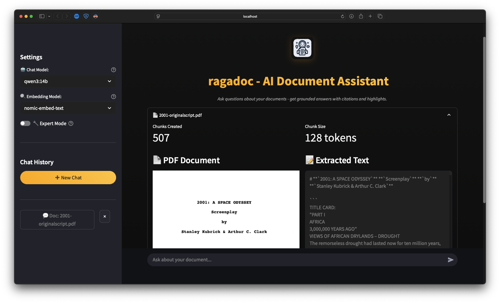
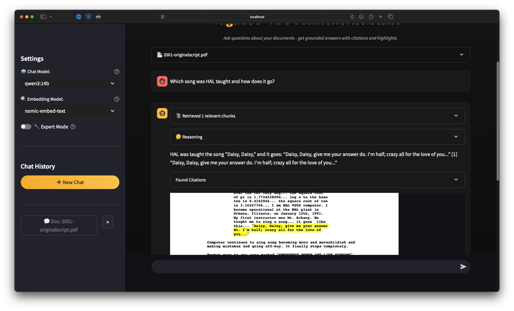

<div align="center">
  
  
  # ragadoc
  
  **An AI document assistant that answers questions about your PDFs with citations and highlights them directly in the document.**
  
  <p><em>Ragadoc is a privacy-first Streamlit application that lets you chat with your documents using locally-run AI models. Ask questions, get grounded answers with citations, and see exactly where the information comes from with automatic PDF highlighting.</em></p>
</div>

## ✨ Key Features

- 🤖 **AI Document Q&A** - Ask natural language questions about your PDFs
- 📍 **Citation Grounding** - Every answer includes specific citations from your document
- 🎯 **PDF Highlighting** - Citations are automatically highlighted in the original PDF
- 🔒 **Complete Privacy** - Uses only local AI models, your documents never leave your computer
- ⚡ **Fast Processing** - Optimized document parsing and retrieval system
- 🌐 **Easy Web Interface** - Simple Streamlit app, no technical knowledge required

<div align="center">
  
  <p><em>Main chat interface with document upload and conversation</em></p>
</div>

<div align="center">
  
  <p><em>Document analysis with citations and highlighted responses</em></p>
</div>

> ⚠️ **Warning: Proof of Concept, Early Development**
> 
> This application is currently in early development and should be considered a proof of concept. Features may be incomplete, unstable, or subject to significant changes. Use at your own discretion and expect potential bugs or breaking changes in future updates.

## 🚀 Quick Start

### Model Selection Guide

Choose models based on your system capabilities:

| Model Type | Model Name | Size | RAM Required | Use Case |
|------------|------------|------|--------------|----------|
| **Embedding** | `nomic-embed-text` | ~274MB | 1GB | **Recommended** - General purpose |
| **Embedding** | `all-minilm` | ~23MB | 512MB | Lightweight alternative |
| **Chat** | `qwen3:14b` | ~8.5GB | 16GB | **Recommended**  |
| **Chat** | `llama3.1:8b` | ~4.7GB | 8GB | Balanced option |
| **Chat** | `mistral:latest` | ~4.1GB | 8GB | Quick responses |
| **Chat** | `phi3:mini` | ~2.3GB | 4GB | Low-resource systems |


### Installation Options

Choose your preferred installation method:

### Option 1: Direct Installation

**Prerequisite: Ollama (for local AI models)**

Install Ollama

```bash
# macOS
brew install ollama

# Or download from https://ollama.com
```
 Start Ollama and install required models

```bash
ollama serve

# Install embedding model (required)
ollama pull nomic-embed-text

# Install a chat model (see recommendations above)
ollama pull qwen3:14b
```


**Additional Prerequisites:**
- Python 3.8+

**Installation Steps:**

1. **Clone the repository**:
   ```bash
   git clone https://github.com/yourusername/ragadoc.git
   cd ragadoc
   ```

2. **Install Python dependencies**:
   ```bash
   pip install -r requirements.txt
   ```
   
   Or with conda:
   ```bash
   conda env create -f environment.yml
   conda activate ragadoc
   ```

3. **Launch the application**:
   ```bash
   streamlit run app.py
   ```

4. **Open your browser** to `http://localhost:8501`

### Option 2: Docker Installation

With this option, you don't need to separately install Ollama, it will automatically
get started by docker compose.

**Prerequisites:**
- Docker and Docker Compose

**Installation Steps:**

1. **Clone the repository**:
   ```bash
   git clone https://github.com/yourusername/ragadoc.git
   cd ragadoc
   ```

2. **Start with Docker Compose**:
   ```bash
   # if you don't have a GPU
   docker-compose up
   
   # if you have a GPU
   docker compose -f docker-compose.yml -f docker-compose.gpu.yml up
   ```

3. **Install models**

   ```
   # embedding model
   docker exec -it ollama ollama pull nomic-embed-text
   
   # chat model
   docker exec -it ollama ollama pull qwen3:14b
   ```

4. **Open your browser** to `http://localhost:8501`

## 📖 How to Use

1. **Upload a PDF** - Drag and drop or browse for your document
2. **Select AI Model** - Choose from your locally installed Ollama models
3. **Start Chatting** - Ask questions about your document in natural language
4. **View Citations** - See highlighted text in the PDF that supports each answer
5. **Explore** - Continue the conversation to dive deeper into your document


## 🏗️ Architecture

Ragadoc uses a modern RAG (Retrieval-Augmented Generation) architecture:

```
PDF Upload → Text Extraction → Chunking → Vector Embeddings
                                               ↓
User Question → Semantic Search → Context Retrieval → AI Response
                                               ↓
                                    Citation Highlighting
```

**Tech Stack:**
- **Frontend**: Streamlit web interface
- **AI Models**: Ollama (local LLMs)
- **Vector DB**: ChromaDB for semantic search
- **PDF Processing**: PyMuPDF4LLM for structure-aware extraction
- **Embeddings**: nomic-embed-text model


## 🐛 Troubleshooting

### Common Issues

**Ollama Connection Error**
```bash
# Verify Ollama is running
curl http://localhost:11434/api/version

# If using Docker, ensure external access
OLLAMA_HOST=0.0.0.0:11434 ollama serve
```

**Slow Performance**
- Try next smaller model
- Reduce chunk size in expert RAG settings
- Ensure sufficient RAM is available

## 📄 License

This project is licensed under the GPL License - see the [LICENSE](LICENSE) file for details.

## 🙏 Acknowledgments

- [Ollama](https://ollama.com) for making local AI accessible
- [Streamlit](https://streamlit.io) for the amazing web framework
- [PyMuPDF](https://pymupdf.readthedocs.io/) for PDF processing
- [ChromaDB](https://www.trychroma.com/) for vector storage

---

**⭐ Star this repo if Ragadoc helps you work with your documents more effectively!**